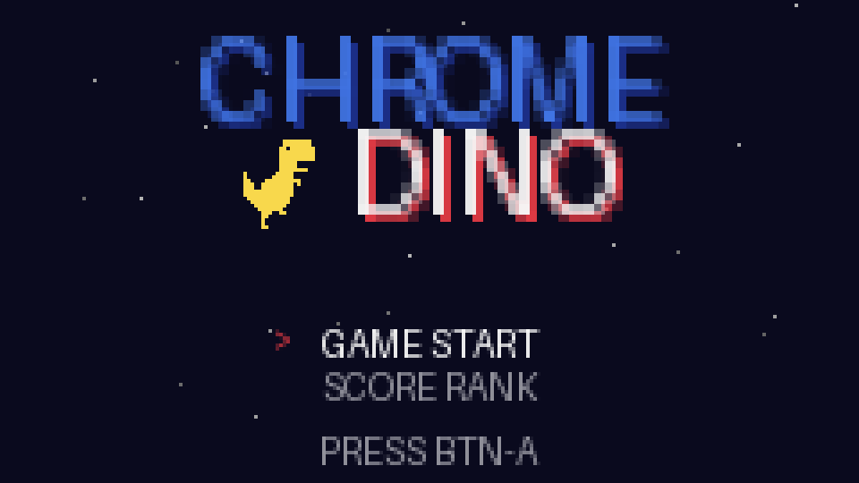
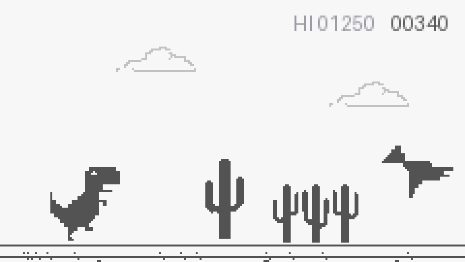

# Chrome Dino @ M5Stack StickS3

**[English](README.md) | [中文](README.zh-CN.md)**

<p>
  
  
</p>

A faithful port of Chrome's offline T-Rex Runner to the M5Stack StickS3 (ESP32-S3), enhanced with a Famicom-style title screen, player names, a local leaderboard, and multi-channel 8-bit BGM.

## Features

- **Faithful port**: run/jump/duck/speed-drop physics, small & large cactus clusters, 3-height pterodactyls, speed ramp, day/night cycle, milestone jingles — physics constants and collision boxes taken from Chromium's official `offline.js`, scaled to the 240×135 screen
- **Famicom-style UI**: animated title drop-in, side-by-side menu, blinking idle dino, breathing-cursor name picker
- **Player system**: random English names (adjective + animal), local Top-5 leaderboard persisted in NVS flash
- **Music**: the original FC/NES *Antarctic Adventure* soundtrack — title jingle + Skaters' Waltz main theme, multi-channel (melody / triangle-wave bass / harmony), extracted voice-by-voice from the official NSF
- **Power management**: dim backlight after 30s idle, light-sleep with instant wake at 5min, auto power-off at 30min; battery gauge in-game
- **Hidden gesture**: press BtnA 5 times within 1s on the leaderboard to wipe all records

## Controls

| Button | Action |
|---|---|
| BtnA (front, blue) | Jump / Confirm |
| BtnB (side) | Duck / Switch menu item / Back |

## Build

Requires [PlatformIO](https://platformio.org/):

```bash
pio run                    # build
pio run -t upload          # flash (if it fails: hold the side reset button ~2s for download mode)
pio test -e native         # 28 pure-logic unit tests on Mac/PC
```

## Docs

- [docs/SPEC.md](docs/SPEC.md) — requirements & acceptance criteria (incl. original-game scaling table)
- [docs/DESIGN.md](docs/DESIGN.md) — architecture
- [docs/adr/](docs/adr/) — architecture decision records
- [docs/CONSTRAINTS.md](docs/CONSTRAINTS.md) — quality & hardware constraints
- [docs/ui/](docs/ui/) — UI mockups at true 240×135 scale

## License

- Project code: MIT (see [LICENSE](LICENSE))
- Game sprites (`assets/`): BSD-3-Clause © The Chromium Authors, extracted from Chromium's `components/neterror/resources`
- BGM note data: the melody is *Les Patineurs* (Émile Waldteufel, 1882, public domain); notes and timings were extracted by signal analysis of the NES recording
- For learning and non-commercial use
